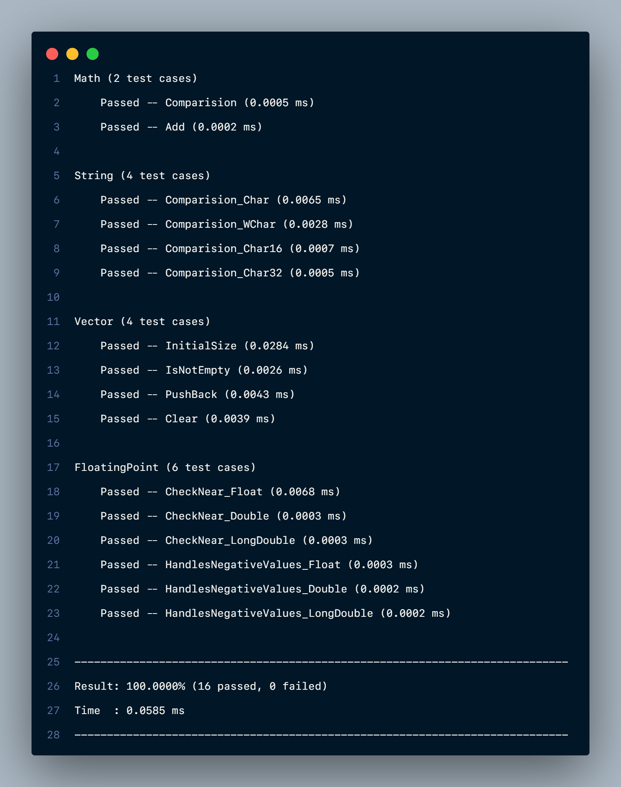

<h1 align="center">simple-test</h1>

<p align="center">
  <strong>A minimal header-only C++ testing framework designed for simplicity and easy integration.</strong>
</p>

<p align="center">
  
  
  
</p>

---

## Features

- Header-only (no build step required)
- No dependencies
- C++17 minimum requirement
- Lightweight test definitions
- Fast to integrate into existing projects

---

## Examples

```c++
#include <simpletest/simpletest.hpp>

int Add(int a, int b) {
  return a + b;
}

TEST_CASE(Math, Comparision) {
  const int a = 1;
  const int b = 4;
  const int c = 1;

  CHECK_EQ(a, c);
  CHECK_NE(b, c);
  CHECK_LT(a, b);
  CHECK_GT(b, a);
  CHECK_LE(a, c);
  CHECK_LE(a, b);
  CHECK_GE(b, a);
  CHECK_GE(c, a);
}

TEST_CASE(Math, Add) {
  CHECK_TRUE(Add(1, 2) == 3);
  CHECK_FALSE(Add(1, 2) != 3);
}

SIMPLETEST_MAIN();
```

```c++
#include <simpletest/simpletest.hpp>

#include <vector>

class Vector {
 public:
  Vector() : vec{1, 2, 3} {}

  void Clear() { vec.clear(); }

  std::vector<int> vec;
};

TEST_FIXTURE(Vector, InitialSize) {
  CHECK_EQ(vec.size(), 3);
}

TEST_FIXTURE(Vector, IsNotEmpty) {
  CHECK_FALSE(vec.empty());
}

TEST_FIXTURE(Vector, PushBack) {
  vec.push_back(4);
  CHECK_EQ(vec[0], 1);
  CHECK_EQ(vec[1], 2);
  CHECK_EQ(vec[2], 3);
  CHECK_EQ(vec[3], 4);
}

TEST_FIXTURE(Vector, Clear) {
  Clear();
  CHECK_TRUE(vec.empty());
}

SIMPLETEST_MAIN();
```

```c++
#include <simpletest/simpletest.hpp>

TEST_CASE(String, Comparision_Char) {
  const char* a = "abc";
  const char* b = "123";
  const char* c = "abc";
  CHECK_STR_EQ(a, c);
  CHECK_STR_NE(a, b);
}

TEST_CASE(String, Comparision_WChar) {
  const wchar_t* a = L"abc";
  const wchar_t* b = L"123";
  const wchar_t* c = L"abc";

  CHECK_STR_EQ(a, c);
  CHECK_STR_NE(a, b);
}

#ifdef __cpp_char8_t
TEST_CASE(String, Comparision_Char8) {
  const char8_t* a = u8"abc";
  const char8_t* b = u8"123";
  const char8_t* c = u8"abc";

  CHECK_STR_EQ(a, c);
  CHECK_STR_NE(a, b);
}
#endif

TEST_CASE(String, Comparision_Char16) {
  const char16_t* a = u"abc";
  const char16_t* b = u"123";
  const char16_t* c = u"abc";

  CHECK_STR_EQ(a, c);
  CHECK_STR_NE(a, b);
}

TEST_CASE(String, Comparision_Char32) {
  const char32_t* a = U"abc";
  const char32_t* b = U"123";
  const char32_t* c = U"abc";

  CHECK_STR_EQ(a, c);
  CHECK_STR_NE(a, b);
}

SIMPLETEST_MAIN();
```

### Output when running the test code in test/



---

## Integration

### Option 1: Header-only (simple include) 
All headers are located inside the `src/simpletest/` directory.

To use it, simply copy the directory into your project and include it:
```c++
#include "simpletest/simpletest.hpp"
```
### Option 2: CMake integration

Add the following to your `CMakeLists.txt` to automatically download and link the library at configure time:

```cmake
include(FetchContent)

FetchContent_Declare(
    simpletest
    GIT_REPOSITORY https://github.com/unknown-0x/simple-test.git
    GIT_TAG        main
)
FetchContent_MakeAvailable(simpletest)

target_link_libraries(your_project PRIVATE simpletest::simpletest)
# Or: target_link_libraries(your_project PRIVATE simpletest::main)
# So you don't need to write `SIMPLETEST_MAIN();`
```

## License

[License](https://github.com/unknown-0x/simple-test/blob/main/LICENSE)
